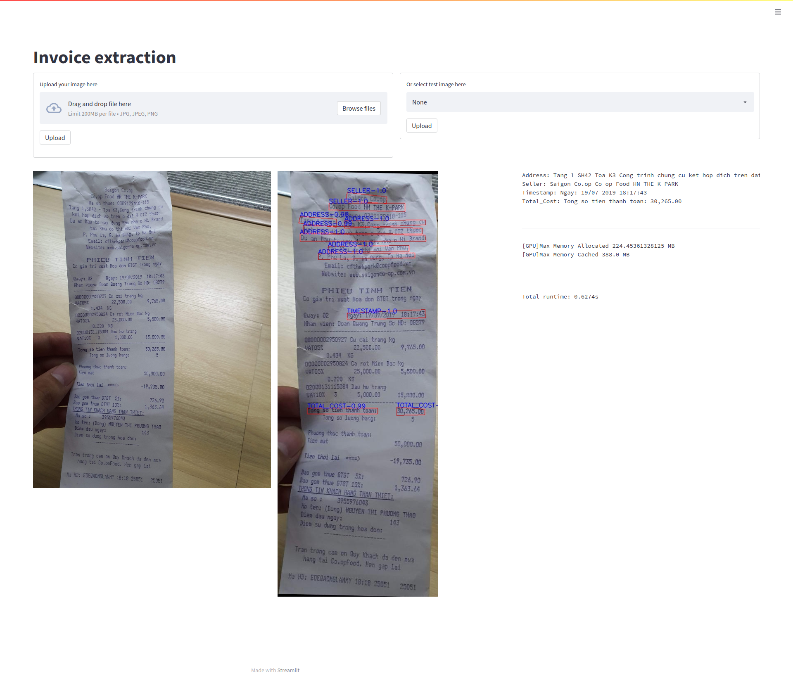

# Key Information Extraction from Scanned Invoices

> Key information extraction from invoice document with Graph Convolution Network

- Related blog post from my Viblo account: https://viblo.asia/p/djeZ1yPGZWz 

### Models

- Background subtraction: U2Net
- Image alignment: computer vision techniques, cv2
- Text detection: CRAFT and an in-house text-detection model
- Text recognition: VietOCR and an in-house text-recognition model
- KIE: Graph Convolution

> Currently, I dont have the invoice-direction classifier model. But you can also develop a model to rotate the image if the image is rotated horizontally or upside down.

### Pretrained model

- [Google Drive](https://drive.google.com/file/d/1VA9hbj3rFlvWimzqoNSrwInIK43qYBLv/view?usp=sharing)


### Data

- MC-OCR, a Vietnamese receipts dataset: https://aihub.vn/competitions/1
- Preprocessed data: [Google Drive](https://drive.google.com/file/d/1KOKuhPErYlJs7l_54lNYfa4Z0DOFMQlm/view?usp=sharing)

### Pipeline

TODO

### Command

- Create virtual environment using conda or virtualenv

```bash
# with virtualenv
virtualenv -p python3 invoice_env
# activate environment
source invoice_env/bin/activate
# install prerequisite libraries
pip install -r requirements.txt
```

```bash
# 1st command, run API
make serve
# 2nd command, run web-gui with streamlit
make runapp
```

Then access the localhost server at: 0.0.0.0:7778

### Preview



### TODO

- Add preprocess data script

### Reference

- MC-OCR dataset: https://aihub.vn/competitions/1
- U2Net: https://github.com/xuebinqin/U-2-Net
- CRAFT: https://github.com/clovaai/CRAFT-pytorch
- VietOCR: https://github.com/pbcquoc/vietocr
- Benchmarking GNNs: https://github.com/graphdeeplearning/benchmarking-gnns
- PaddleOCR: https://github.com/PaddlePaddle/PaddleOCR
